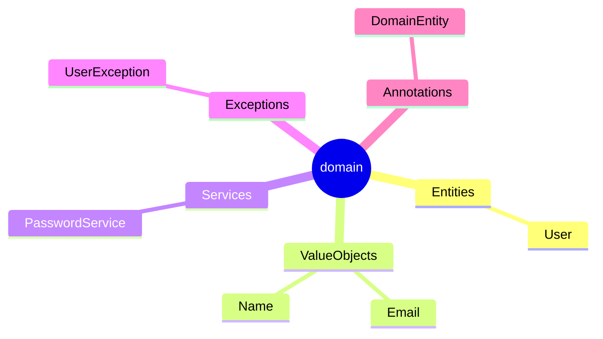

# Documentation Skill

Write docs for WHY and WHERE. Code documents WHAT.

## What gets documented

| Thing                              | Where                               |
|------------------------------------|-------------------------------------|
| Feature design, decisions, flows   | `{module}/docs/{feature}/`          |
| Module rules, patterns, naming     | `{module}/CLAUDE.md`                |
| Cross-cutting architecture rules   | Root `CLAUDE.md` or a skill file    |
| Domain model (entity + VO diagram) | `domain/docs/{feature}/{Entity}.md` |
| API contracts (endpoint shapes)    | `docs/API_CONTRACTS.md`             |
| Test strategy                      | `docs/TEST_STRATEGY.md`             |
| In-progress tracker                | `docs/CLAUDE_PROGRESS.md`           |

## Module doc index — `GRAPH.md`

Each module maintains `{module}/docs/GRAPH.md`. One fenced `mermaid` block. Mindmap format.



**Never edit GRAPH.md manually for a simple file add/remove.** Use `doc-graph-updater` agent — it syncs filename lists automatically.

Trigger `doc-graph-updater` after: creating, deleting, or renaming any `{module}/docs/` file.

## Feature doc structure

One file per doc unit. Keep files `<300 lines`. Split if larger.

Suggested structure for an entity doc:

```markdown
# {Entity}

One-sentence purpose.

## Invariants

- bullet list of business rules enforced in init / create()

## Fields

| Field | Type   | Rule                |
|-------|--------|---------------------|
| id    | UserId | generated on create |
| email | Email  | unique, RFC-5322    |

## Behavior

Describe non-obvious methods, factory logic, mutation points.

## Decisions

- Why this field is a VO not a raw type
- Why this invariant lives here vs in use case
```

## Comments in code

Write only when WHY is non-obvious. Never write what the code already says.

```kotlin
// bad — explains what
// create user and save to repo
val user = User.create(...)
repo.save(user)

// good — explains a non-obvious constraint
// Mongo upsert not used here: save() resets version field, breaking optimistic locking
repo.insert(user.toDocument())
```

Never:
- Reference the current task, PR, or issue number in code comments.
- Write "TODO: implement" — either implement or open a ticket.
- Write multi-line docstrings explaining obvious logic.

## When to update CLAUDE.md

Update `{module}/CLAUDE.md` when:
- New naming convention adopted for that module.
- New pattern added (e.g., new mapper style, new test base class).
- New "when to ask" decision made (e.g., new external dep policy).

Do NOT put feature-specific content in `CLAUDE.md` — that belongs in `{module}/docs/`.

## Skill files vs CLAUDE.md

| Content | Belongs in |
|---------|-----------|
| Project-wide patterns (hexagonal, error, testing) | Skill file under `.claude/skills/` |
| Module-specific rules (folder layout, imports allowed) | `{module}/CLAUDE.md` |
| Cross-module naming table | Root `CLAUDE.md` |
| Examples that only load when skill triggers | Skill file body |

## Docs freshness

Docs rot. Flag stale docs when:
- A field or class referenced in a doc no longer exists.
- A decision in CLAUDE.md contradicts current code pattern.
- GRAPH.md lists a file that was deleted.

Fix: update the doc, not the code (unless both are wrong).

## ADR (Architecture Decision Record)

For significant decisions (new pattern, new dependency, layer rule change):

```markdown
# ADR-{n}: {Short title}

**Date:** YYYY-MM-DD  
**Status:** accepted | superseded by ADR-{m}

## Context
What problem prompted this decision?

## Decision
What was decided?

## Consequences
What becomes easier? What becomes harder?
```

Store in `docs/adr/` if adopted. Not mandatory for small decisions — `## Decisions` section in `{module}/CLAUDE.md` is sufficient.
