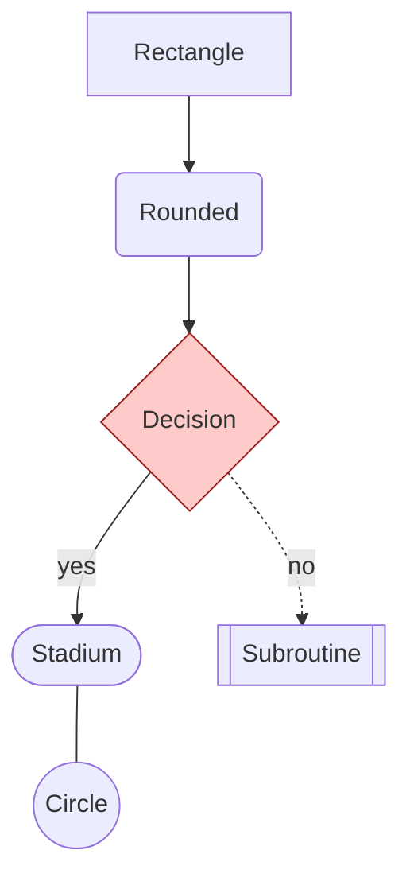
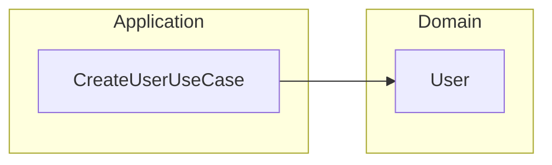
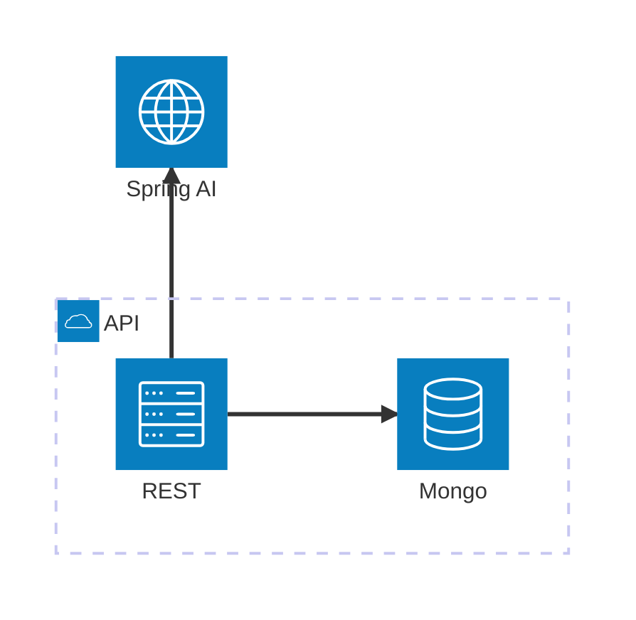
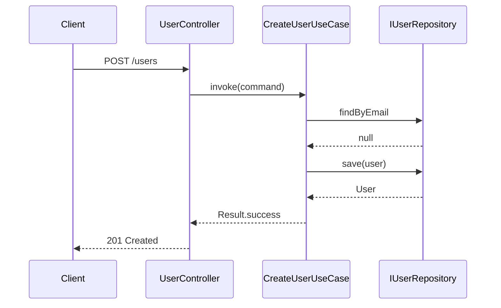
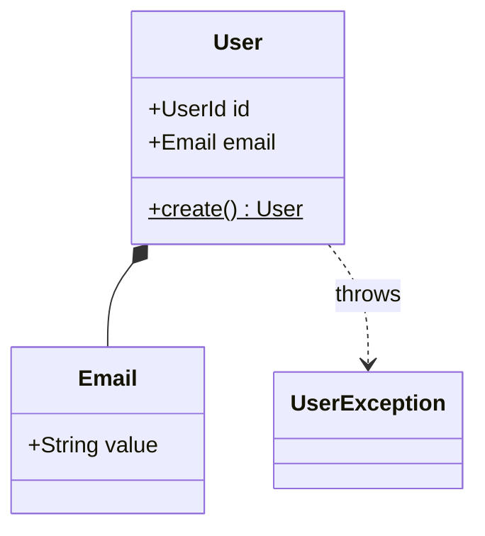
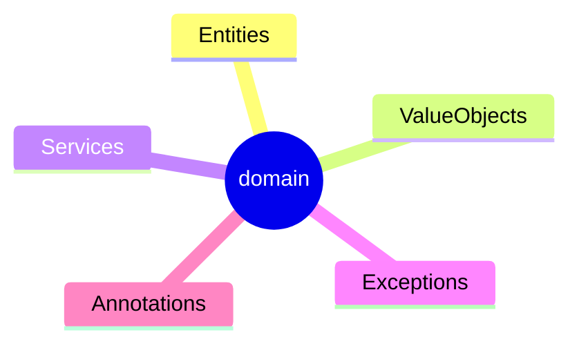
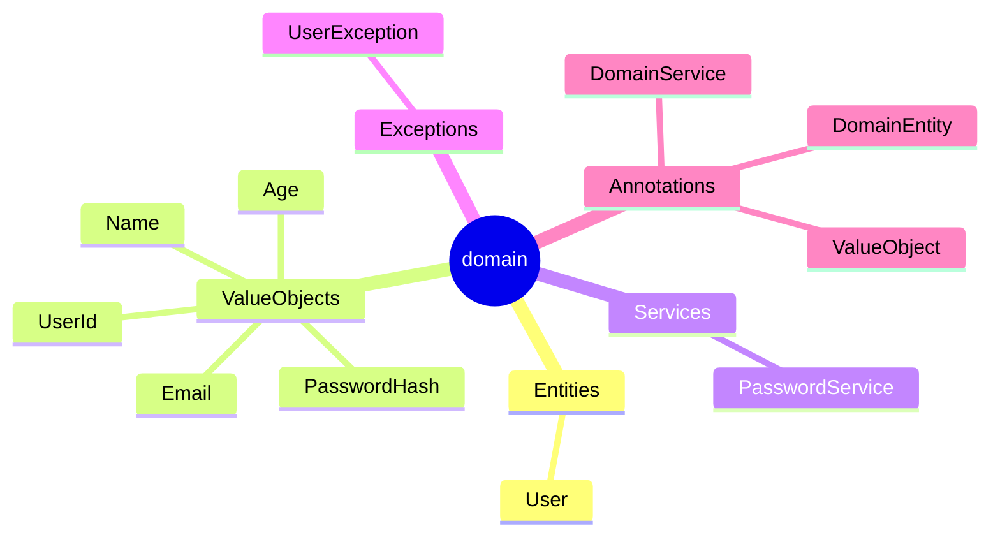

# Mermaid Skill

Diagrams as code. Render in any Markdown that runs Mermaid (GitHub, GitLab, VS Code, mermaid.live). This project uses Mermaid for: hexagonal architecture diagrams, per-module doc graphs (`{module}/docs/GRAPH.md`), sequence flows in feature docs, ADRs.

## Pick the right diagram

| Use case                                              | Diagram                       |
|-------------------------------------------------------|-------------------------------|
| Doc graph, generic node-edge model                    | `flowchart TD`                |
| System / cloud architecture (db, server, queue)       | `architecture-beta`           |
| Use-case call sequence (controller → use case → port) | `sequenceDiagram`             |
| Domain model (entities + relations)                   | `classDiagram` or `erDiagram` |
| State machine of an entity                            | `stateDiagram-v2`             |
| C4 model (context/container/component/code)           | `C4Context` etc.              |

Default to `flowchart` unless one of the others is clearly better.

## Flowchart — primary syntax



Direction: `TD` `LR` `BT` `RL`. Shapes: `[]` rect · `()` rounded · `{}` diamond · `([])` stadium · `[[]]` subroutine · `(())` circle · `[/...\]` parallelogram. Edges: `-->` arrow · `---` line · `-.->` dotted · `==>` thick · `-->|label|` labeled. Subgraphs:



Click directives: `click NodeId "url" "tooltip"` opens link · `click NodeId callback "tooltip"` calls JS. Use to make doc-graph nodes navigable.

## Architecture-beta — for system topology



Edges anchor on side: `T B L R`. Default icons: `cloud database disk internet server`. Iconify icons via `"prefix:name"` (e.g. `"logos:kotlin"`). Junctions: `junction j1` for 4-way splits.

## Sequence — for call flows



Arrows: `->>` solid · `-->>` dashed reply · `-x` cross (lost). `Note over A,B:` for callouts. `loop` `alt` `opt` for control flow.

## Class diagram — domain model



Relations: `<|--` inheritance · `*--` composition · `o--` aggregation · `-->` association · `..>` dependency · `..|>` realization.

## Theming, colors, classDef

```
classDef entity      fill:#fde68a,stroke:#92400e
classDef valueobject fill:#bfdbfe,stroke:#1e3a8a
class User entity
class Email,Name valueobject
```

Init block at top to switch theme:

````
%%{init: {'theme':'dark'}}%%
flowchart TD ...
````

## Project-specific: `GRAPH.md` files

Each module has `{module}/docs/GRAPH.md` whose **only** content is one fenced ```mermaid block.

Conventions (decided 2026-04-26 — Option A: hierarchical index, no edges):
- Diagram type: `mindmap` (not flowchart). No cross-references between docs — `doc-graph-updater` is filename-only and does not parse content.
- Root: `root((<module name>))`.
- Branches under root = doc-type buckets (e.g. `Entities`, `ValueObjects`, `UseCases`, `RestControllers`, ...).
- Leaves under each bucket = `.md` filenames (one per file, basename without `.md`).
- 2-space indentation per level. Mismatched indentation breaks rendering.
- Empty buckets: keep the bucket node with no children — do not add a placeholder leaf.
- Do NOT include `GRAPH.md` itself as a leaf.

Bucket list per module is defined in the `doc-graph-updater` agent prompt.

### Mindmap shapes available

`A` plain · `A[text]` square · `A(text)` rounded · `A((text))` circle · `A{{text}}` cloud/hexagon · `A))text((` bang. Conventional: root uses `((...))` circle.

### Empty state (current 3 modules)



### Populated state (target shape after docs land)



### Why mindmap (not flowchart)

Mindmap is a strict tree — no cross-edges between branches. Picked because the agent only tracks filenames, not content. If the agent ever needs to express "User depends on Email" or "controller calls use case", switch to `flowchart TD` with `subgraph`s — see `mermaid` flowchart section above.

## Validation checklist

Before saving a diagram:
- [ ] Block is fenced ```` ```mermaid ```` (not `` ` ``mermaid).
- [ ] Diagram type declared on first non-comment line.
- [ ] No empty `subgraph ... end` (renderer errors).
- [ ] Node ids are unique and ASCII-safe (`[A-Za-z0-9_]`). Quotes for labels with special chars: `A["my label"]`.
- [ ] Edge labels escape pipes inside text via quotes: `A -->|"a|b"| B`.
- [ ] `classDef` declared before `class` use.
- [ ] Render-test in https://mermaid.live before committing big diagrams.

## Common pitfalls

- Mixing `graph` and `flowchart` keywords — both work, but `flowchart` supports more shapes. Prefer `flowchart`.
- Forgetting `end` for each `subgraph` (errors silently in some renderers).
- `architecture-beta` is still beta — pin Mermaid version if rendering server-side.
- Long labels overflow — wrap with `<br/>` or shorten ids and rely on tooltip via `click`.
- Markdown inside node labels: use `markdown` shape (`A@{shape: rect, label: "**bold**"}`) — Mermaid 11.3+.

## References

- Syntax index — https://mermaid.js.org/intro/syntax-reference.html
- Flowchart — https://mermaid.js.org/syntax/flowchart.html
- Architecture (beta) — https://mermaid.js.org/syntax/architecture.html
- Sequence — https://mermaid.js.org/syntax/sequenceDiagram.html
- Class — https://mermaid.js.org/syntax/classDiagram.html
- ER — https://mermaid.js.org/syntax/entityRelationshipDiagram.html
- State — https://mermaid.js.org/syntax/stateDiagram.html
- C4 — https://mermaid.js.org/syntax/c4.html
- Theming — https://mermaid.js.org/config/theming.html
- Live editor — https://mermaid.live
