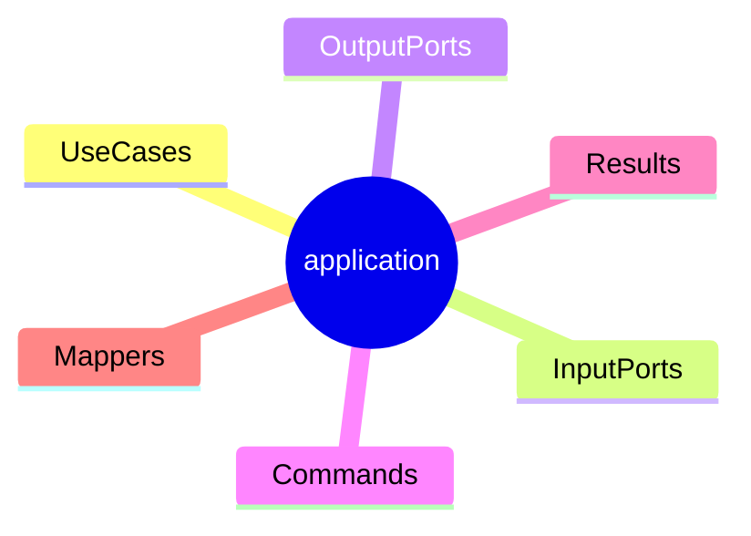

```mermaid
%% Application documentation index
%% Root = module. Branches = doc type. Leaves = .md filenames.
%% Owner = doc-graph-updater agent. Filenames-only — no edge inference.

mindmap
  root((application))
    UseCases
    InputPorts
    OutputPorts
    Commands
    Results
    Mappers
```
