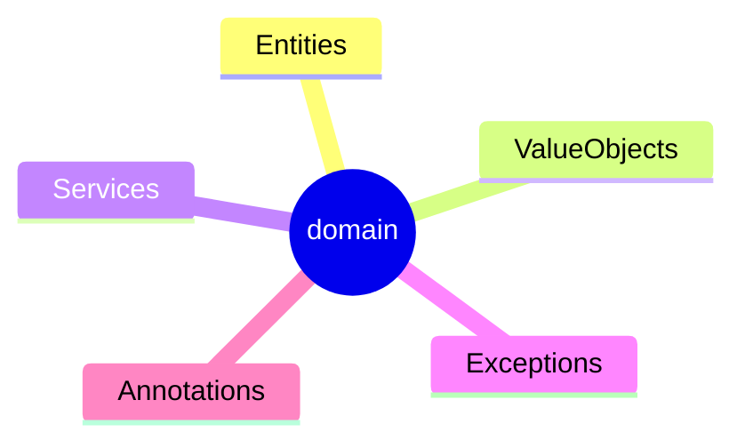

```mermaid
%% Domain documentation index
%% Root = module. Branches = doc type. Leaves = .md filenames.
%% Owner = doc-graph-updater agent. Filenames-only — no edge inference.

mindmap
  root((domain))
    Entities
    ValueObjects
    Services
    Exceptions
    Annotations
```
