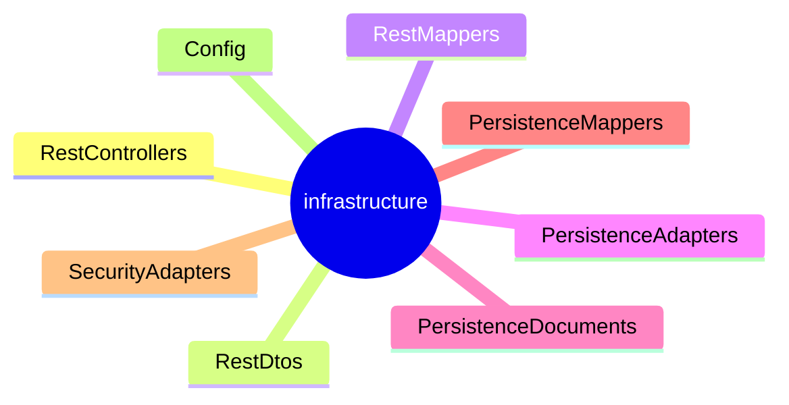

```mermaid
%% Infrastructure documentation index
%% Root = module. Branches = doc type. Leaves = .md filenames.
%% Owner = doc-graph-updater agent. Filenames-only — no edge inference.

mindmap
  root((infrastructure))
    RestControllers
    RestDtos
    RestMappers
    PersistenceAdapters
    PersistenceDocuments
    PersistenceMappers
    SecurityAdapters
    Config
```
